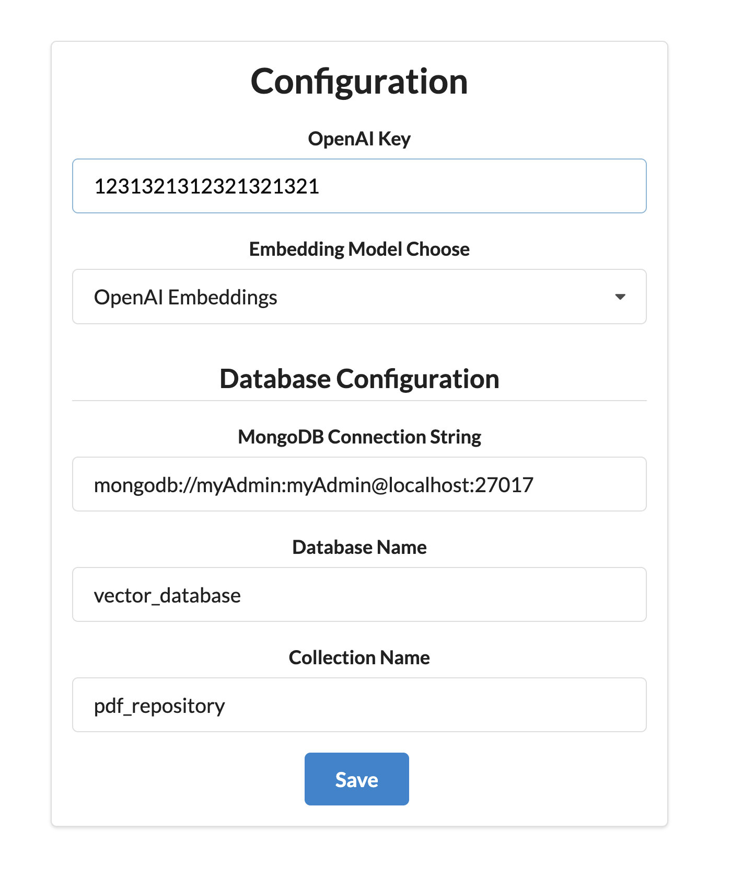
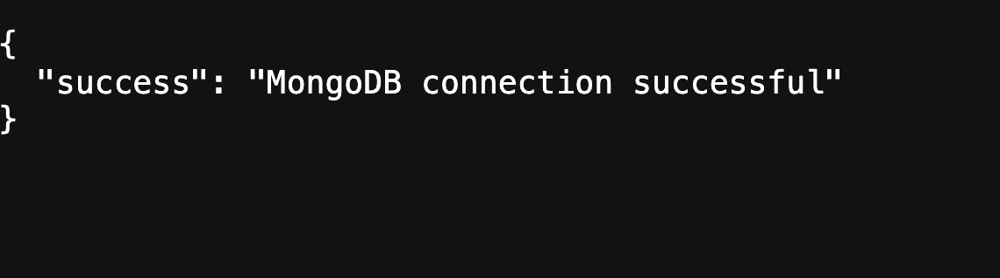
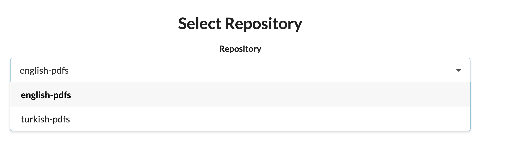
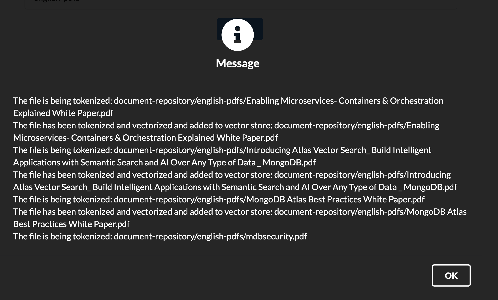
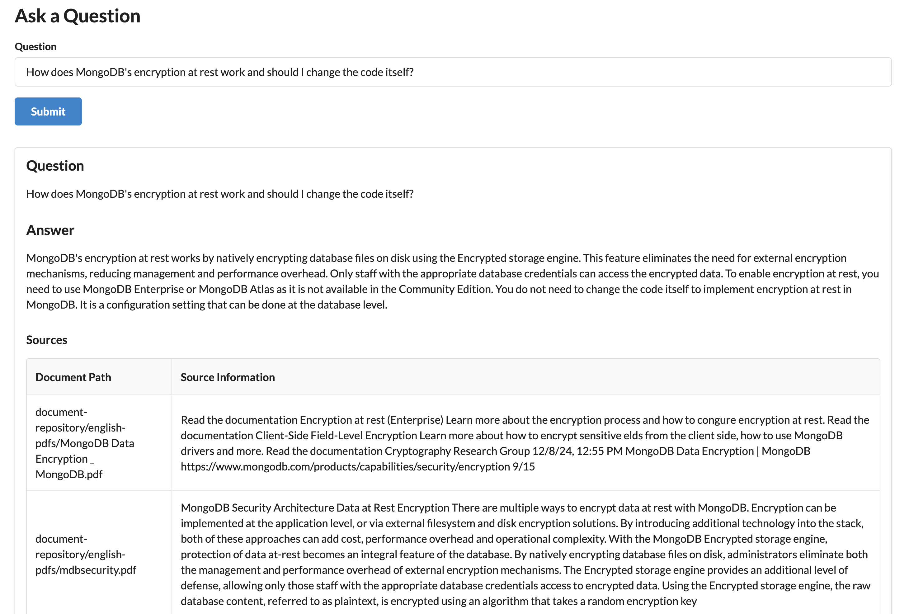
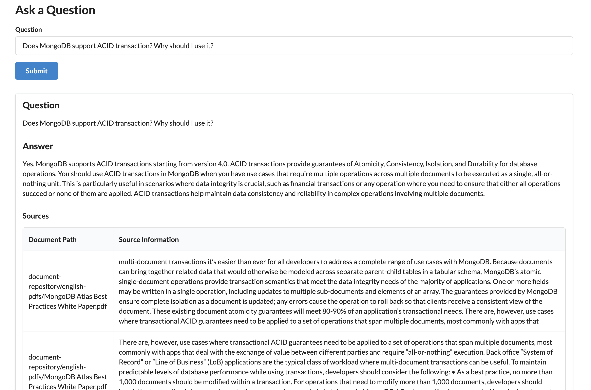

# Chat with Your PDF using MongoDB Vector Search 

## (English and Turkish are available - Arabic is coming)

This project allows you to interact with PDF documents using natural language queries. It uses OpenAI embeddings, vector search via MongoDB, and LangChain's RetrievalQA pipeline to provide intelligent responses based on the content of PDF files.

## Features

- Load and split PDF files into manageable text chunks.
- Generate embeddings for the text using OpenAI or VoyageAI.
- Store the embeddings in a MongoDB collection.
- Use MongoDB Vector Search for retrieving relevant text chunks.
- Perform Retrieval-Augmented Generation (RAG) using OpenAI's ChatGPT to answer questions.

## Prerequisites

- Python 3.9+
- MongoDB (and mongot vector search support)
- OpenAI API key for LLM
- An API key for OpenAI or Voyage AI if you intend to use those paid embedding models; the MPNet model is free to use.
- Required Python packages:
  - `langchain`
  - `langchain_openai`
  - `langchain_mongodb`
  - `pymongo`
  - `PyPDF2` or `pypdf` for PDF parsing


## Embedding Models

This Python code supports three embedding models:

- **Open AI Embeddings** (Paid): Uses `OpenAIEmbeddings` with your OpenAI API key.
- **MongoDB Voyage AI Embeddings** (Paid): Uses `VoyageAIEmbeddings` with your Voyage AI API key.
- **MPNet-Base-V2** (Free): Uses `HuggingFaceEmbeddings` with the `sentence-transformers/paraphrase-multilingual-mpnet-base-v2` model.


## Which repository to be used
There are 2 document repositories now:
- A document repository with MongoDB related information in English language, under the `english-pdfs` folder
- A document repository with news in Turkey regarding economy, agriculture, etc. in Turkish language, under `turkish-pdfs` folder
- If you are not going to use the existing repositories under the `document-repository/` folder, please add your pdfs into a folder under `document-repository/` folder such as `document-repository/my-pdfs/1.pdf` 


## Setup

1. Clone the repository.
2. Install the required dependencies:
    ```bash
    pip install -r requirements.txt
    ```
3. Launch the application `python app.py`
4. Click `Config` and provide *Open AI API Key* and if you choose *Voyage AI* as embeddings then provide *Voyage AI API Key* too. And then provide *MongoDB Connection String* and *Database Name* and *Collection Name*. And then click *Save*.
5. After you saved it, you can get back and click *Show Config* to verify what you provided (your config is stored in config.json file).
6. Click `Empty Repository` to drop the collection if it exists already.
7. Click `Create Vector Search Index`.
8. Click `Build Repository` and choose the desired repository `english-pdfs` or `turkish-pdfs` and the click `Build`.
9. Wait pdf files to be tokenized and vectorized and load into the database.


---

## Usage

Run the script using command-line arguments:

In the same web application

1. Click `Ask a Question` button.
2. Example Questions:
- If you used `english-pdfs` repo:
    - "_How does MongoDB's encryption at rest work and should I change the code itself?_"
    - "_Does MongoDB support ACID transaction? Why should I use it?_"
- If you used `turkish-pdfs` repo:
    - "_Türkiye, çiçekçilik konusunda nerelere odaklanarak gelir arttırabilir?_"
    - "_Bankacılık sektörü, Türkiye'nin ne kadarlık Gayrı Safi Milli Hasılasına tekabül etmektedir?_"
    - "_Kur Korumalı Mevduat bakiyesinin son durumu nedir, artıyor mu azalıyor mu?_" 


## Screenshots

### Configuration Page 


### Configuration Success 


### Repository choose


### Vectorization in Progress


### Example Query 001


### Example Query 002
